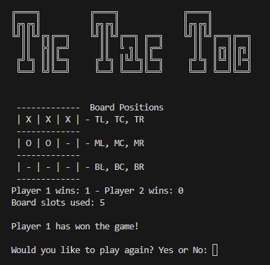
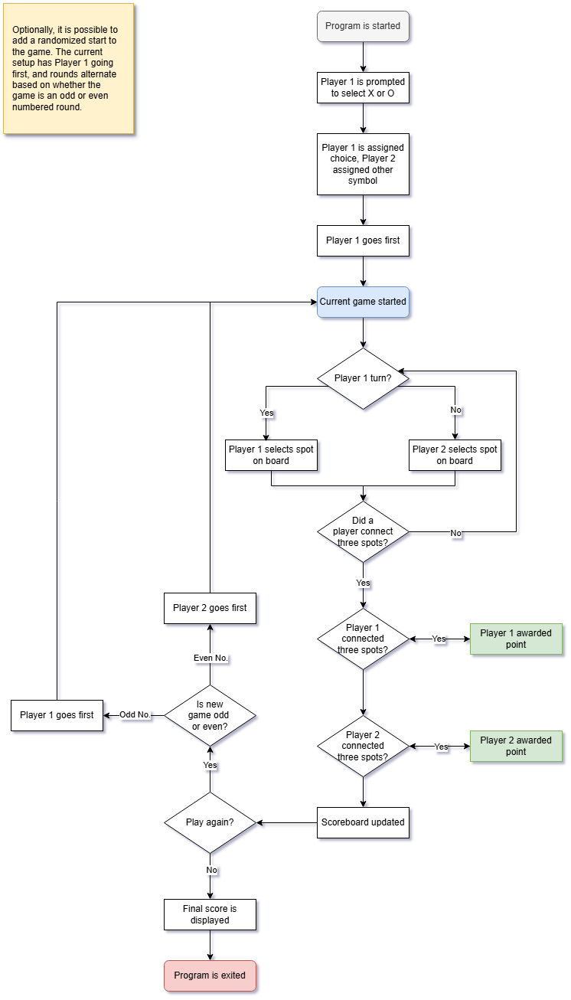

# 100 Days of Code Day 84: Tic-Tac-Toe CLI Game

## Modules Used
### Os module
The **os** module is used in this project to clear the screen after each turn and when the screen needs to be updated.
### Random (Not used in final version)
The **random** module is not used in the current iteration of this project. However, it can be used to randomize aspects of the Tic-Tac-Toe game, such as who starts the game first.
## Project Files
### Game_board.py
**Game_board.py** contains the **TicTacToe class**, which contains various methods responsible for displaying various stages of the game. Each method prints the games screen on the terminal. This class works in conjunction with the **print_board() function** in main.py.
### Main.py
**Main.py** is where all the game's logic takes place. The project walkthrough section will go into further detail.
## Project Walkthrough
The program first starts by asking the user to select what symbol they would like to be, this being X or O. These values are assigned to variables so that player 1 and player 2 have a symbol assigned when they select a spot on the board. 

In the current program’s state, player 1 will go first. *There is functionality to randomize this, but I left it as is for the scope of this project. *

The program then enters a loop that continues until the user specifies that they no longer want to play the game.

As for the gameplay itself, the current game continues until a player has scored a winning combination. Each time a player makes a choice, the screen is refreshed, and the tic-tac-toe board displays the updated gameboard.

When a player wins the game, the current game ends, and the winning player gets a point. The user is then prompted if they would like to play again. If the user selects yes, the gameboard is reset and a new game is started. Depending on if the new game is an odd or even round, player 1 goes first if the round is odd (1, 3, 5, etc.) and player 2 goes first if the round is even (2, 4, 6, etc.). If the user selects no, the final score is displayed, and the game is exited. 

## Project Flowchart
